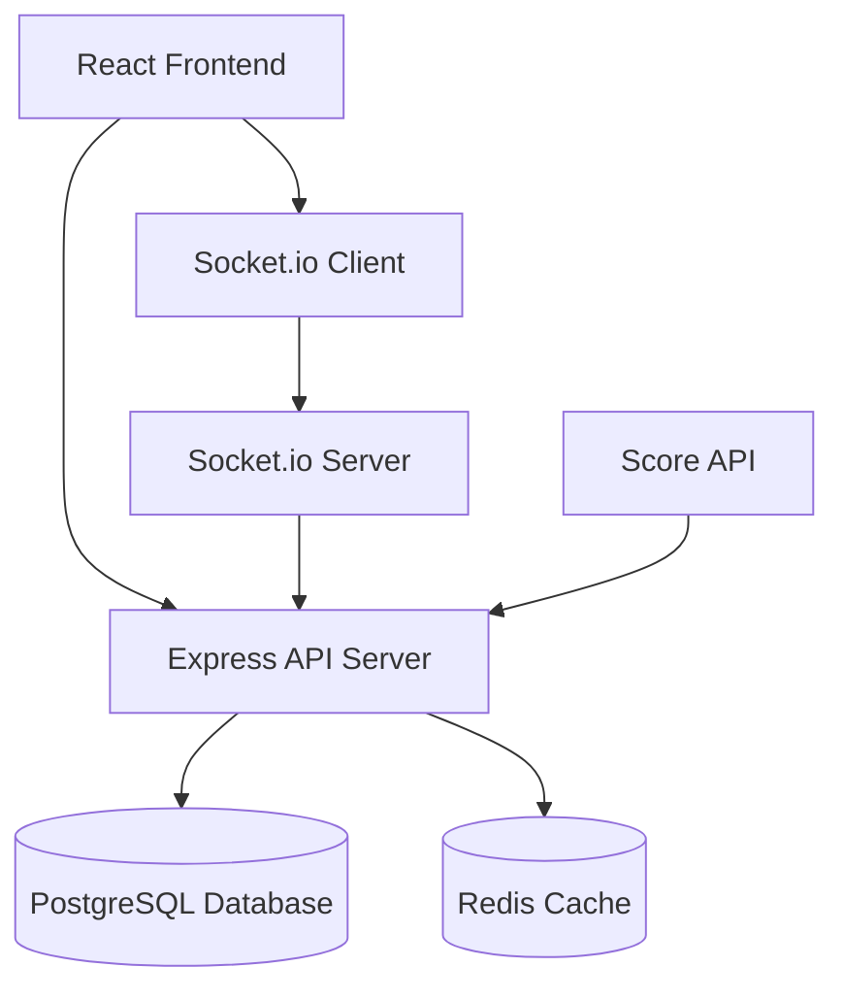

# Design Document

## Overview

The March Madness Squares web application is a responsive, real-time betting pool management system built with modern web technologies. The application enables users to participate in tournament squares pools through an intuitive interface that works seamlessly across desktop and mobile devices.

The system follows a client-server architecture with real-time updates, secure authentication, and automated square assignment. Key features include user management, board creation and management, payment tracking, random assignment algorithms, and live score integration.

## Architecture

### Technology Stack

**Frontend:**
- React 18 with TypeScript for type safety and modern development
- Tailwind CSS for responsive design and mobile-first approach
- Socket.io client for real-time score updates
- React Router for client-side routing
- React Hook Form for form management and validation

**Backend:**
- Node.js with Express.js framework
- TypeScript for consistent type safety across the stack
- Socket.io for real-time communication
- JWT for secure authentication
- bcrypt for password hashing

**Database:**
- PostgreSQL for relational data with ACID compliance
- Prisma ORM for type-safe database operations
- Redis for session management and real-time data caching

**Deployment:**
- Docker containers for consistent deployment
- Environment-based configuration
- HTTPS/SSL for secure communication

### System Architecture



## Components and Interfaces

### Frontend Components

**Authentication Components:**
- `LoginForm`: Email/password authentication with validation
- `RegisterForm`: Display name, email, password registration
- `AuthGuard`: Route protection for authenticated users
- `AdminGuard`: Additional protection for admin-only routes

**Board Management Components:**
- `BoardList`: Display available boards with status indicators
- `BoardDetail`: Individual board view with squares grid
- `SquareGrid`: 10x10 interactive grid with user assignments
- `ClaimSquares`: Interface for selecting number of squares (0-10)
- `PaymentStatus`: Visual indicators for pending/paid squares

**Tournament Components:**
- `ScoreTable`: Real-time game scores and results
- `WinnerDisplay`: Highlight winning squares and payouts
- `TournamentBracket`: Visual representation of tournament progress

**Admin Components:**
- `AdminDashboard`: Board management and user oversight
- `BoardCreator`: Form for creating new boards
- `PaymentManager`: Interface for marking squares as paid
- `UserManager`: View and manage user accounts

### Backend API Endpoints

**Authentication Routes:**
```
POST /api/auth/register - User registration
POST /api/auth/login - User authentication
POST /api/auth/logout - Session termination
GET /api/auth/me - Current user profile
```

**Board Routes:**
```
GET /api/boards - List available boards
POST /api/boards - Create new board (admin)
GET /api/boards/:id - Get board details
POST /api/boards/:id/claim - Claim squares on board
PUT /api/boards/:id/assign - Trigger square assignment (admin)
```

**Admin Routes:**
```
GET /api/admin/boards - All boards management view
PUT /api/admin/squares/:id/payment - Mark square as paid
GET /api/admin/users - User management
POST /api/admin/scores - Update game scores
```

**Real-time Events:**
```
score_update - Live score changes
square_claimed - New square reservations
payment_confirmed - Square payment updates
board_filled - Board completion notifications
winner_announced - Game result notifications
```

## Data Models

### User Model
```typescript
interface User {
  id: string
  email: string (unique)
  displayName: string
  passwordHash: string
  isAdmin: boolean
  createdAt: Date
  updatedAt: Date
}
```

### Board Model
```typescript
interface Board {
  id: string
  name: string
  pricePerSquare: number
  payoutStructure: PayoutStructure
  status: 'open' | 'filled' | 'assigned' | 'active' | 'completed'
  createdAt: Date
  updatedAt: Date
  squares: Square[]
  games: Game[]
}
```

### Square Model
```typescript
interface Square {
  id: string
  boardId: string
  userId: string | null
  gridPosition: number | null (0-99)
  paymentStatus: 'pending' | 'paid'
  winningTeamNumber: number | null (0-9)
  losingTeamNumber: number | null (0-9)
  createdAt: Date
}
```

### Game Model
```typescript
interface Game {
  id: string
  boardId: string
  gameNumber: number
  round: string
  team1: string
  team2: string
  team1Score: number | null
  team2Score: number | null
  status: 'scheduled' | 'in_progress' | 'completed'
  winnerSquareId: string | null
  scheduledTime: Date
}
```

### PayoutStructure Model
```typescript
interface PayoutStructure {
  round1: number    // Games 1-32
  round2: number    // Games 33-48  
  sweet16: number   // Games 49-56
  elite8: number    // Games 57-60
  final4: number    // Games 61-62
  championship: number // Game 63
}
```

## Error Handling

### Frontend Error Handling
- Global error boundary for React component errors
- Form validation with user-friendly error messages
- Network error handling with retry mechanisms
- Loading states and error states for all async operations

### Backend Error Handling
- Centralized error middleware for consistent error responses
- Input validation using Joi or similar validation library
- Database constraint error handling
- Authentication and authorization error responses
- Rate limiting to prevent abuse

### Error Response Format
```typescript
interface ErrorResponse {
  error: {
    code: string
    message: string
    details?: any
  }
  timestamp: string
  path: string
}
```

## Testing Strategy

### Frontend Testing
- **Unit Tests**: Jest and React Testing Library for component testing
- **Integration Tests**: Testing user flows and API integration
- **E2E Tests**: Cypress for critical user journeys
- **Responsive Tests**: Cross-device and cross-browser testing

### Backend Testing
- **Unit Tests**: Jest for individual function and service testing
- **Integration Tests**: Supertest for API endpoint testing
- **Database Tests**: Test database operations with test database
- **Socket Tests**: Testing real-time communication

### Test Coverage Goals
- Minimum 80% code coverage for critical paths
- 100% coverage for authentication and payment logic
- Performance testing for concurrent user scenarios
- Security testing for authentication and authorization

### Testing Scenarios
- User registration and authentication flows
- Square claiming and payment workflows
- Random assignment algorithm verification
- Real-time score update propagation
- Mobile responsiveness across devices
- Admin functionality and permissions
- Error handling and edge cases

## Security Considerations

### Authentication & Authorization
- JWT tokens with appropriate expiration times
- Password hashing using bcrypt with salt rounds
- Role-based access control for admin functions
- Session management with secure cookies

### Data Protection
- Input sanitization and validation
- SQL injection prevention through parameterized queries
- XSS protection with content security policies
- CORS configuration for API access control

### Infrastructure Security
- HTTPS enforcement for all communications
- Environment variable management for secrets
- Rate limiting on API endpoints
- Database connection security and encryption