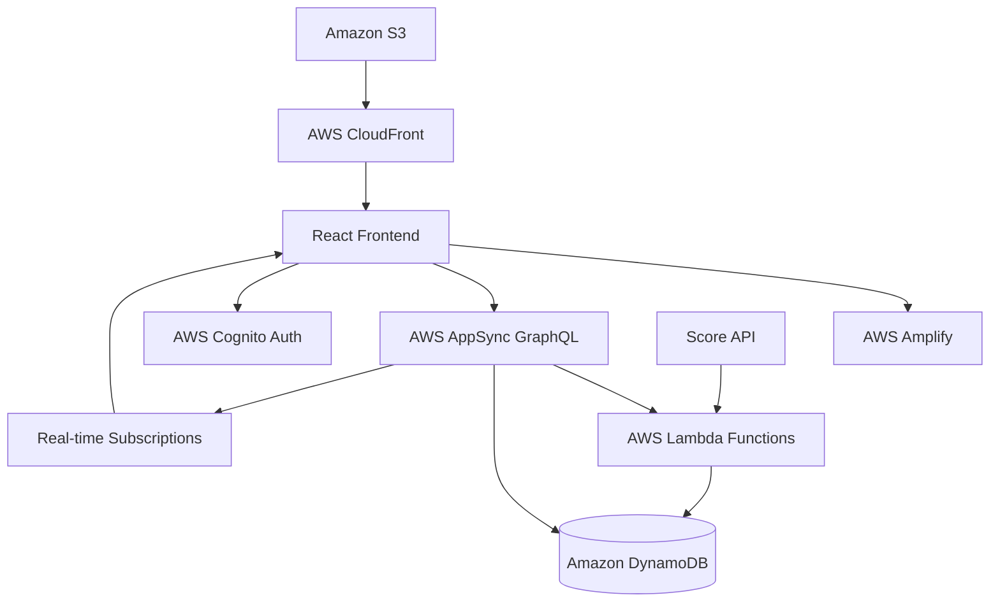

# Design Document

## Overview

The March Madness Squares web application is a responsive, real-time betting pool management system built with modern web technologies. The application enables users to participate in tournament squares pools through an intuitive interface that works seamlessly across desktop and mobile devices.

The system follows a client-server architecture with real-time updates, secure authentication, and automated square assignment. Key features include user management, board creation and management, payment tracking, random assignment algorithms, and live score integration.

## Architecture

### Technology Stack

**Frontend:**
- React 18 with TypeScript for type safety and modern development
- Tailwind CSS for responsive design and mobile-first approach
- AWS Amplify UI components for consistent design
- React Router for client-side routing
- React Hook Form for form management and validation

**Backend (AWS Amplify):**
- AWS Amplify for full-stack development platform
- AWS AppSync for GraphQL API with real-time subscriptions
- AWS Cognito for user authentication and authorization
- AWS Lambda for serverless business logic
- TypeScript for consistent type safety across functions

**Database:**
- Amazon DynamoDB for NoSQL data storage with auto-scaling
- AWS Amplify DataStore for offline-first data synchronization
- DynamoDB Global Secondary Indexes for efficient querying

**Real-time & Storage:**
- AWS AppSync subscriptions for real-time updates
- Amazon S3 for file storage (if needed for future features)
- AWS CloudFront for global content delivery

**Deployment:**
- AWS Amplify hosting for automatic CI/CD
- Environment-based configuration with AWS Systems Manager
- HTTPS/SSL automatically managed by AWS

### System Architecture



## Components and Interfaces

### Frontend Components

**Authentication Components:**
- `LoginForm`: Email/password authentication with validation
- `RegisterForm`: Display name, email, password registration
- `AuthGuard`: Route protection for authenticated users
- `AdminGuard`: Additional protection for admin-only routes

**Board Management Components:**
- `BoardList`: Display available boards with status indicators
- `BoardDetail`: Individual board view with squares grid
- `SquareGrid`: 10x10 interactive grid with user assignments
- `ClaimSquares`: Interface for selecting number of squares (0-10)
- `PaymentStatus`: Visual indicators for pending/paid squares

**Tournament Components:**
- `ScoreTable`: Real-time game scores and results
- `WinnerDisplay`: Highlight winning squares and payouts
- `TournamentBracket`: Visual representation of tournament progress

**Admin Components:**
- `AdminDashboard`: Board management and user oversight
- `BoardCreator`: Form for creating new boards
- `PaymentManager`: Interface for marking squares as paid
- `UserManager`: View and manage user accounts

### GraphQL API Operations

**Authentication (AWS Cognito):**
- User registration, login, and logout handled by AWS Cognito
- JWT tokens automatically managed by Amplify Auth
- User profile data synchronized with DynamoDB

**GraphQL Queries:**
```graphql
# List available boards
query ListBoards {
  listBoards {
    items {
      id name status totalSquares claimedSquares
    }
  }
}

# Get board details with squares
query GetBoard($id: ID!) {
  getBoard(id: $id) {
    id name status squares { items { id userId gridPosition paymentStatus } }
  }
}

# Get user's claimed squares
query GetUserSquares($userId: ID!) {
  squaresByUser(userId: $userId) {
    items { id boardId gridPosition paymentStatus }
  }
}
```

**GraphQL Mutations:**
```graphql
# Create new board (admin only)
mutation CreateBoard($input: CreateBoardInput!) {
  createBoard(input: $input) {
    id name status
  }
}

# Claim squares on board
mutation ClaimSquares($input: ClaimSquaresInput!) {
  claimSquares(input: $input) {
    squares { id userId paymentStatus }
  }
}

# Update payment status (admin only)
mutation UpdateSquarePayment($input: UpdateSquarePaymentInput!) {
  updateSquarePayment(input: $input) {
    id paymentStatus
  }
}

# Update game scores (admin only)
mutation UpdateGameScore($input: UpdateGameScoreInput!) {
  updateGameScore(input: $input) {
    id team1Score team2Score status
  }
}
```

**GraphQL Subscriptions (Real-time):**
```graphql
# Subscribe to board updates
subscription OnBoardUpdate($boardId: ID!) {
  onBoardUpdate(boardId: $boardId) {
    id status squares { items { userId paymentStatus } }
  }
}

# Subscribe to score updates
subscription OnScoreUpdate {
  onScoreUpdate {
    id team1Score team2Score status winnerSquareId
  }
}

# Subscribe to square claims
subscription OnSquareClaimed($boardId: ID!) {
  onSquareClaimed(boardId: $boardId) {
    id userId gridPosition paymentStatus
  }
}
```

## Data Models (DynamoDB Schema)

### User Model
```typescript
interface User {
  id: string                    // Partition Key (PK)
  email: string                 // GSI-1 PK for email lookups
  displayName: string
  isAdmin: boolean
  createdAt: string            // ISO string format
  updatedAt: string            // ISO string format
  // Note: Password handled by AWS Cognito, not stored in DynamoDB
}
```

### Board Model
```typescript
interface Board {
  id: string                    // Partition Key (PK)
  name: string
  pricePerSquare: number
  payoutStructure: PayoutStructure
  status: 'open' | 'filled' | 'assigned' | 'active' | 'completed'
  totalSquares: number          // Always 100
  claimedSquares: number        // Count of claimed squares
  paidSquares: number           // Count of paid squares
  createdAt: string            // ISO string format
  updatedAt: string            // ISO string format
  createdBy: string            // User ID of creator
  // GSI-2: status (PK) + createdAt (SK) for status-based queries
}
```

### Square Model
```typescript
interface Square {
  id: string                    // Partition Key (PK)
  boardId: string              // GSI-1 PK for board-based queries
  userId: string | null         // GSI-2 PK for user-based queries
  gridPosition: number | null   // 0-99, assigned after board is filled
  paymentStatus: 'pending' | 'paid'
  winningTeamNumber: number | null  // 0-9, assigned during random assignment
  losingTeamNumber: number | null   // 0-9, assigned during random assignment
  createdAt: string            // ISO string format
  claimOrder: number           // Order in which square was claimed (1-100)
  // GSI-1: boardId (PK) + claimOrder (SK)
  // GSI-2: userId (PK) + createdAt (SK)
}
```

### Game Model
```typescript
interface Game {
  id: string                    // Partition Key (PK)
  boardId: string              // GSI-1 PK for board-based queries
  gameNumber: number           // 1-63 for March Madness
  round: string                // 'round1', 'round2', 'sweet16', etc.
  team1: string
  team2: string
  team1Score: number | null
  team2Score: number | null
  status: 'scheduled' | 'in_progress' | 'completed'
  winnerSquareId: string | null
  scheduledTime: string        // ISO string format
  completedAt: string | null   // ISO string format
  // GSI-1: boardId (PK) + gameNumber (SK)
  // GSI-2: status (PK) + scheduledTime (SK)
}
```

### PayoutStructure Model (Embedded in Board)
```typescript
interface PayoutStructure {
  round1: number               // Games 1-32
  round2: number               // Games 33-48  
  sweet16: number              // Games 49-56
  elite8: number               // Games 57-60
  final4: number               // Games 61-62
  championship: number         // Game 63
}
```

### DynamoDB Table Design
- **Single Table Design**: All entities in one table with composite keys
- **Primary Key**: `PK` (Partition Key) + `SK` (Sort Key) where needed
- **Global Secondary Indexes**:
  - GSI-1: Entity-specific queries (boardId, userId, etc.)
  - GSI-2: Status and time-based queries
  - GSI-3: Email-based user lookups

## Error Handling

### Frontend Error Handling
- Global error boundary for React component errors
- AWS Amplify error handling with automatic retry mechanisms
- Form validation with user-friendly error messages using AWS Amplify UI
- Loading states and error states for all GraphQL operations
- Offline support with AWS Amplify DataStore conflict resolution

### Backend Error Handling (AWS Lambda)
- AWS Lambda error handling with proper HTTP status codes
- Input validation using AWS AppSync resolvers and schema validation
- DynamoDB error handling for constraint violations
- AWS Cognito authentication error responses
- AWS AppSync automatic rate limiting and throttling

### GraphQL Error Response Format
```typescript
interface GraphQLErrorResponse {
  errors: Array<{
    message: string
    locations?: Array<{ line: number; column: number }>
    path?: Array<string | number>
    extensions?: {
      code: string
      exception?: any
    }
  }>
  data?: any
}
```

### AWS Amplify Error Categories
- `AuthError`: Authentication and authorization failures
- `APIError`: GraphQL API operation failures  
- `DataStoreError`: Local data synchronization issues
- `StorageError`: S3 file operation failures
- `NetworkError`: Connectivity and timeout issues

## Testing Strategy

### Frontend Testing
- **Unit Tests**: Jest and React Testing Library for component testing
- **Integration Tests**: Testing user flows and API integration
- **E2E Tests**: Cypress for critical user journeys
- **Responsive Tests**: Cross-device and cross-browser testing

### Backend Testing (AWS Lambda)
- **Unit Tests**: Jest for individual Lambda function testing
- **Integration Tests**: AWS Amplify mock testing for GraphQL operations
- **Database Tests**: DynamoDB Local for testing database operations
- **Subscription Tests**: Testing real-time GraphQL subscriptions

### Test Coverage Goals
- Minimum 80% code coverage for critical paths
- 100% coverage for authentication and payment logic
- Performance testing for concurrent user scenarios
- Security testing for authentication and authorization

### Testing Scenarios
- User registration and authentication flows
- Square claiming and payment workflows
- Random assignment algorithm verification
- Real-time score update propagation
- Mobile responsiveness across devices
- Admin functionality and permissions
- Error handling and edge cases

## Security Considerations

### Authentication & Authorization (AWS Cognito)
- JWT tokens automatically managed by AWS Cognito with configurable expiration
- Password policies and multi-factor authentication support
- Role-based access control using Cognito User Groups
- Fine-grained permissions with AWS IAM and AppSync authorization

### Data Protection
- Input validation through GraphQL schema and AWS AppSync resolvers
- NoSQL injection prevention with DynamoDB parameterized operations
- XSS protection with AWS Amplify's built-in sanitization
- CORS automatically configured by AWS AppSync

### Infrastructure Security (AWS Managed)
- HTTPS/TLS automatically enforced by AWS services
- Environment variables securely managed by AWS Systems Manager
- Automatic rate limiting and DDoS protection via AWS AppSync
- VPC and network security managed by AWS
- Data encryption at rest (DynamoDB) and in transit (all AWS services)
- AWS CloudTrail for audit logging and compliance

### AWS Amplify Security Features
- Automatic security headers and CSP policies
- Built-in protection against common web vulnerabilities
- Secure by default configuration for all AWS services
- Regular security updates managed by AWS